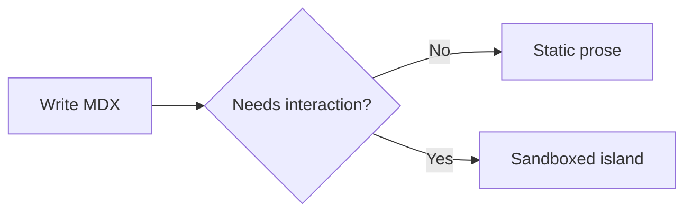
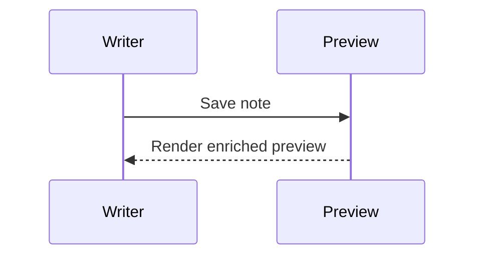
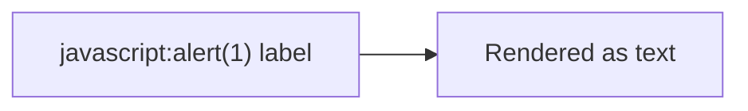

# Editor Enrichment Test

Inline math should render as KaTeX: $E = mc^2$.

Inline source enrichment should distinguish ==highlighted text==, [[Welcome]], and #project from ordinary prose.

Conservative parser checks should stay plain: $5 and $10, a == b, and a single `{` brace.

Block math should render as KaTeX:

$$
\int_0^\infty e^{-x^2} dx = \frac{\sqrt{\pi}}{2}
$$

## Highlighted Code

```ts
type Result<T> = { ok: true; value: T } | { ok: false; error: string }

export function unwrap<T>(result: Result<T>): T {
  if (!result.ok) {
    throw new Error(result.error)
  }

  return result.value
}
```

```python
def fibonacci(n: int) -> list[int]:
    values = [0, 1]
    while len(values) < n:
        values.append(values[-1] + values[-2])
    return values[:n]
```

```json
{
  "feature": "editor-enrichment",
  "enabled": true,
  "cases": ["math", "code", "callouts", "mermaid"]
}
```

```
This code fence has no language and should stay readable.
```

## Callouts

> [!note]
> A note callout with ordinary prose.

> [!tip] Custom tip title
> A tip callout with **bold text** and a nested list.
>
> - Keep the note portable.
> - Keep behavior explicit.

> [!warning]
> A warning callout with nested code.
>
> ```ts
> const trustBoundary = 'renderer'
> ```

> [!danger]
> A danger callout for unsafe content.

> [!info]
> An info callout with a [[Welcome]] wikilink.

> This is a normal blockquote and should not become a callout.

## Mermaid







## Sanitize Regression

<script>alert('script should be stripped')</script>


<a href="javascript:alert('link should be stripped')">Unsafe JavaScript link</a>

Safe mark syntax should survive sanitize: ==safe marked text==.
